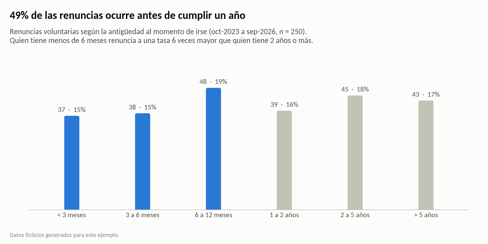
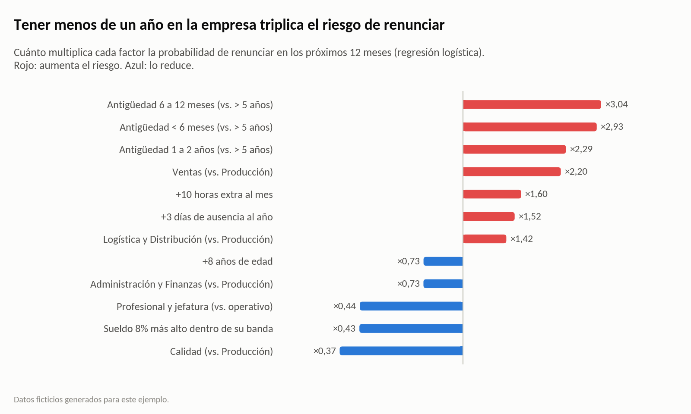
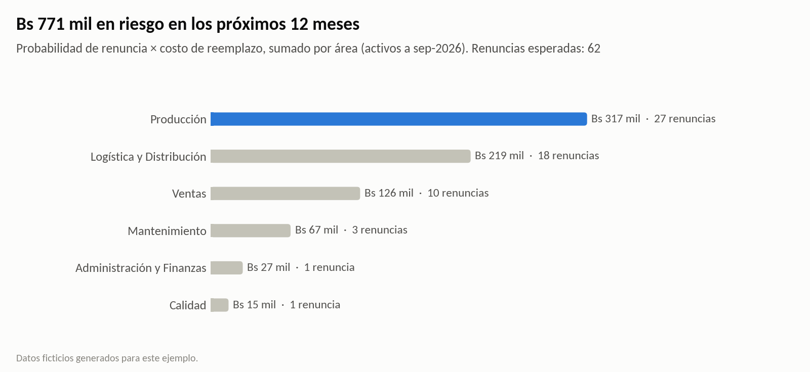
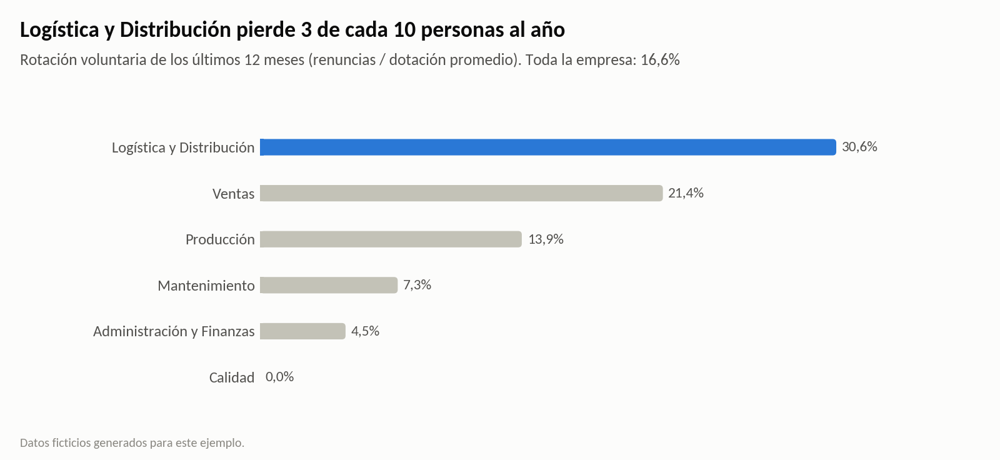
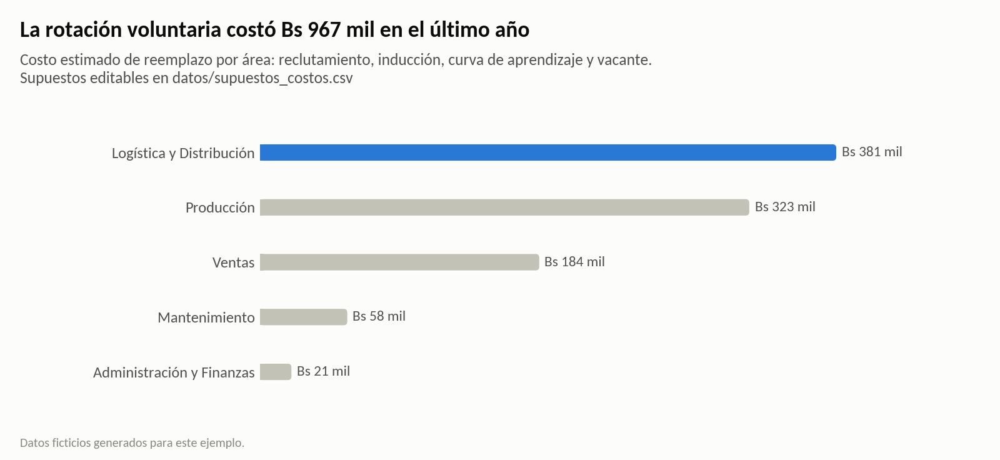

# ¿Cuánto le cuesta la rotación a una embotelladora?

**People Analytics con Python.** Este análisis muestra dónde se concentra la rotación y en qué momento se va la gente. También calcula cuánto cuesta en bolivianos y quién tiene más probabilidad de renunciar en los próximos 12 meses.



> **Datos ficticios.** Corresponden a una embotelladora mediana de unos 500 colaboradores, entre octubre de 2023 y septiembre de 2026, y se generan con `generar_datos.py`. Los números sirven para mostrar el método; no describen a ninguna empresa real.

## Resultados

| Pregunta | Respuesta |
|---|---|
| ¿Cuánta gente se va? | La rotación voluntaria del último año fue de **16,6%**. En Logística y Distribución llegó al **31%**. |
| ¿Cuándo se va? | El **49%** de las renuncias ocurre antes de cumplir un año. Con menos de 6 meses en la empresa, la tasa de renuncia es **6 veces** la de alguien con 2 años o más. |
| ¿Cuánto cuesta? | **Bs 966.625** en el último año, unos **Bs 11.240 por renuncia**. Reemplazar a una persona cuesta entre 2,7 y 5,3 sueldos, según el nivel. Además, se perdieron **Bs 90.526** de reclutamiento e inducción en personas que se fueron antes de los 6 meses. |
| ¿Quién está en riesgo? | Entre el 20% de personas con mayor riesgo según el modelo (AUC 0,78) estaba el **53%** de quienes después renunciaron. Hoy hay **Bs 770.660 en riesgo** y unas **62 renuncias esperadas** en los próximos 12 meses. |
| ¿Qué hacer primero? | **Cuidar el primer año.** Si las renuncias de ese tramo bajan un 30%, el ahorro estimado es de **unos Bs 158.000 al año**. |

## Cómo se hizo

1. **Datos.** `generar_datos.py` simula la planilla mensual de cada persona con la lógica de una planilla boliviana: haber básico, bono de antigüedad, horas extra al doble, aportes patronales y provisiones de aguinaldo e indemnización. También simula las altas y bajas de 36 meses.
2. **Rotación.** Se mide por área y por antigüedad al momento de irse. La tasa por tramo usa meses-persona, para corregir que en la empresa hay más gente antigua que nueva.
3. **Costo de reemplazo.** Se calcula por nivel con cuatro componentes: reclutamiento, inducción, curva de aprendizaje y vacante cubierta con horas extra. Los supuestos están en `datos/supuestos_costos.csv` y se pueden cambiar.
4. **Modelo de probabilidad de renuncia.** Es una regresión logística, elegida porque se puede explicar: cada factor "multiplica el riesgo por X".
   - Se entrena con una foto de las personas activas al 30/09/2025 y con quién renunció en los 12 meses siguientes.
   - Se valida con validación cruzada estratificada de 5 particiones.
5. **Bolivianos en riesgo.** Para cada persona activa hoy, se multiplica su probabilidad de renunciar por su costo de reemplazo. La lista también indica el factor que más sube el riesgo de cada persona, para saber qué conversación tener con cada uno.





| | |
|---|---|
|  |  |

## Estructura

```
├── analisis_rotacion.ipynb     análisis completo, con resultados y gráficos
├── generar_datos.py            genera los datos ficticios (semilla fija)
├── graficos.py                 estilo de los gráficos
├── requirements.txt
├── datos/
│   ├── colaboradores.csv       una fila por persona
│   ├── planilla_mensual.csv    una fila por persona y mes
│   └── supuestos_costos.csv    supuestos del costo de reemplazo (editables)
├── resultados/
│   └── riesgo_actual.csv       probabilidad, costo esperado y factor principal de cada persona activa
└── img/                        gráficos del análisis
```

## Cómo correrlo

```bash
pip install -r requirements.txt
python generar_datos.py          # opcional: los datos ya están en datos/
jupyter notebook analisis_rotacion.ipynb
```

## Límites

- Con datos reales, hay que reentrenar el modelo y validar los supuestos de costo con Finanzas.
- El modelo encuentra quién se parece a los que se fueron, no por qué se fueron. Las ausencias, por ejemplo, pueden ser un síntoma de que alguien ya está buscando otro trabajo.
- El costo es conservador: no incluye el efecto en el clima del equipo ni los errores de quien recién aprende.

**Herramientas:** Python · pandas · scikit-learn · matplotlib

---

### English summary

This is a People Analytics case study on a fictional bottling company with about 500 employees, using synthetic data from October 2023 to September 2026.
- It measures voluntary turnover by area and by tenure at exit, and estimates replacement cost in bolivianos.
- It trains an explainable logistic regression (cross-validated AUC 0.78) that flags who is likely to resign in the next 12 months.
- It estimates the money at risk for each person as probability × replacement cost.

Key finding: 49% of resignations happen in the first year, so onboarding is where the money is.

---

Vicente Asbun · [LinkedIn](https://www.linkedin.com/in/vicente-antonio-asbun-karmy-30aa19164/)
